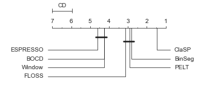
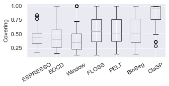
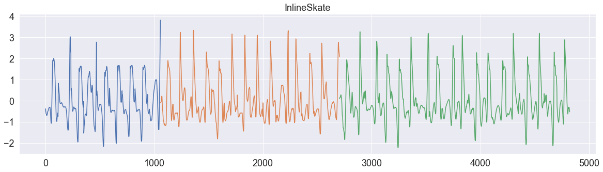
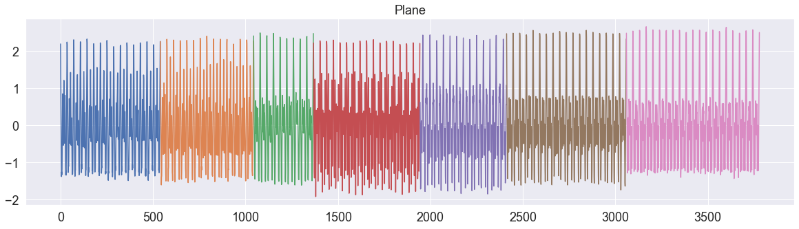

# Time Series Segmentation Benchmark (TSSB)
The problem of time series segmentation (TSS) is to find a meaningful segmentation of a time series (TS) that captures a data-generating process with distinct states and transitions. We consider a segmentation meaningful, if the change points (CPs) between two consecutive segments correspond to state transitions in the associated process. 

This repository contains the time series segmentation benchmark (TSSB). It currently contains 75 annotated TS with 1-9 segments. Each TS is constructed from one of the <a target="_blank" href="http://timeseriesclassification.com/">UEA & UCR time series classification</a> datasets. We group TS by label and concatenate them to create segments with distinctive temporal patterns and statistical properties. We annotate the offsets at which we concatenated the segments as CPs. Addtionally, we apply resampling to control the dataset resolution and add approximate, hand-selected window sizes that are able to capture temporal patterns. We have a <a target="_blank" href="https://github.com/ermshaua/time-series-segmentation-benchmark/blob/main/tssb/notebooks/dataset_generation.ipynb">jupyter notebook</a> that shows how to automatically perform the transformation.   

## Installation
You can install the TSSB with PyPi:
`python -m pip install git+https://github.com/ermshaua/time-series-segmentation-benchmark` 

## Citation
If you use the TSSB in your scientific publication, we would appreciate the following citations:

```
@article{clasp2023,
  title={ClaSP: parameter-free time series segmentation},
  author={Arik Ermshaus and Patrick Sch{\"a}fer and Ulf Leser},
  journal={Data Mining and Knowledge Discovery},
  year={2023},
}

@inproceedings{clasp2021,
  title={ClaSP - Time Series Segmentation},
  author={Sch{\"a}fer, Patrick and Ermshaus, Arik and Leser, Ulf},
  booktitle={CIKM},
  year={2021}
}
```

## Results

We have evaluated 7 time series segmentation algorithms using the TSSB. The following table summarises the average segmentation Covering (higher is better) and the corresponding mean ranks. Evaluation details are in the <a target="_blank" href="https://doi.org/10.1007/s10618-023-00923-x">paper</a>. The raw result sheet and an evaluation notebook are in the <a target="_blank" href="https://github.com/ermshaua/time-series-segmentation-benchmark/tree/main/tssb/notebooks">notebooks</a> folder.

| Segmentation Algorithm | Mean Accuracy | Mean Rank | Wins & Ties |
|------------------------|---------------| --------- |-------------
| ClaSP                  |  85.47%             | 1.5       | 54/75         |
| BinSeg                 |  57.49%             | 2.8       | 12/75         |
| PELT                   |  58.1%             | 2.9       | 12/75         |
| FLOSS                  |  56.74%             | 3.1       | 12/75         |
| Window                 |  40.1%             | 4.3       | 7/75         |
| BOCD                   |  44.88%             | 4.3       | 6/75         |
| ESPRESSO               |  44.36%             | 4.6       | 4/75         |

The mean ranks are visualized in the followind critical difference (CD) diagram. Not significantly different algorithms are connected with a horizontal bar based
on a Nemenyi two tailed significance test with a = 0.05. The boxplot illustrates the summary statistics.

<p float="left">
  
  
</p>

## Basic Usage
Let's first import methods to load TS from the benchmark and to evaluate TSS algorithms. As an example, we also import our segmentation algorithm ClaSP from <a target="_blank" href="https://github.com/ermshaua/claspy">claspy</a>. 

```python3
>>> from tssb.utils import load_time_series_segmentation_datasets
>>> from tssb.evaluation import covering
>>> from claspy.segmentation import BinaryClaSPSegmentation
```

We can now load the entire benchmark (75 TS) as a pandas dataframe using 

```python3
>>> tssb = load_time_series_segmentation_datasets()
```

or a selection of TS by specifying the `names` attribute using

```python3
>>> tssb = load_time_series_segmentation_datasets(names=["ArrowHead", "InlineSkate", "Plane"])
```

The dataframe `tssb` contains (TS name, window size, CPs, TS) rows and can now be iterated to evaluate a TSS algorithm.

```python3
>>> for _, (ts_name, window_size, cps, ts) in tssb.iterrows():
>>>   found_cps = BinaryClaSPSegmentation().fit_predict(ts)
>>>   score = covering({0: cps}, found_cps, ts.shape[0])
>>>   print(f"Time Series: {ts_name}: True Change Points: {cps}, Found Change Points: {found_cps.tolist()}, Score: {score}")
```

In a similar fashion, you can evaluate your TSS algorithm and compare results. For more details, see the example <a href="https://github.com/ermshaua/time-series-segmentation-benchmark/tree/main/tssb/notebooks">notebooks</a>.

## Visualizations

See the following example TS to get an overview of the TSSB. You can find more images in the <a href="https://github.com/ermshaua/time-series-segmentation-benchmark/tree/main/tssb/visualizations">visualizations</a> folder.






In order to create a visualization of your predicted segmentation, you can use the following code.

```python3
>>> import matplotlib.pyplot as plt
>>> from tssb.utils import visualize_time_series
>>> fig, ax = visualize_time_series(ts, ts_name, cps, found_cps)
>>> plt.show()
```


